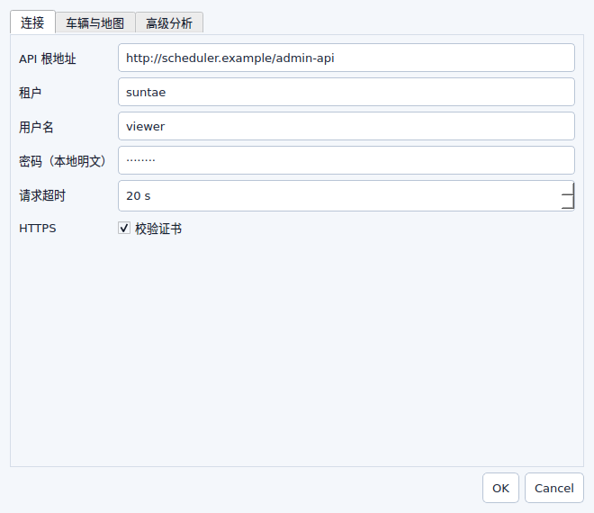
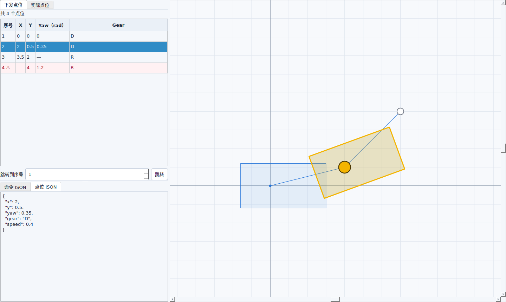
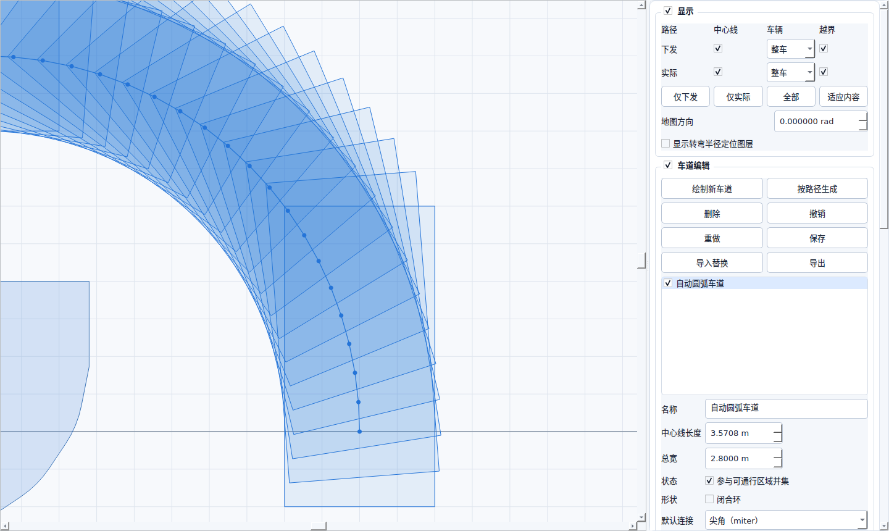
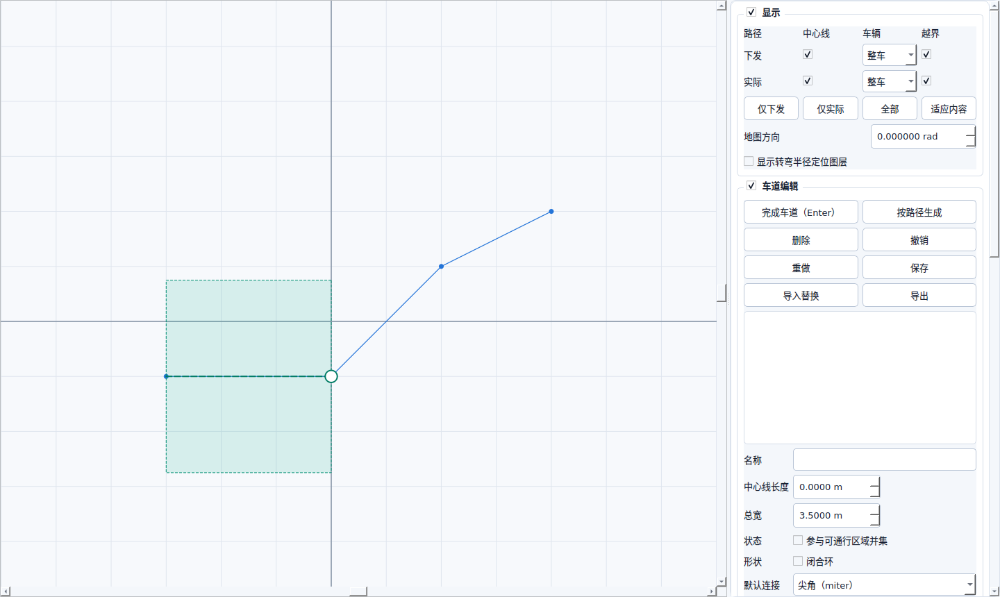
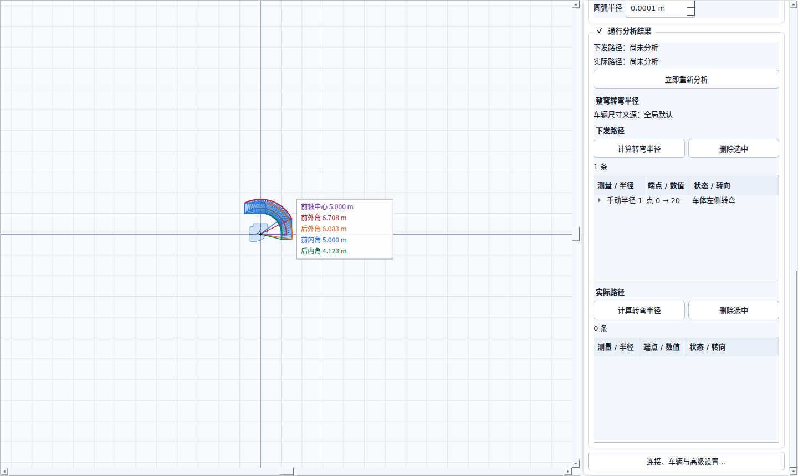
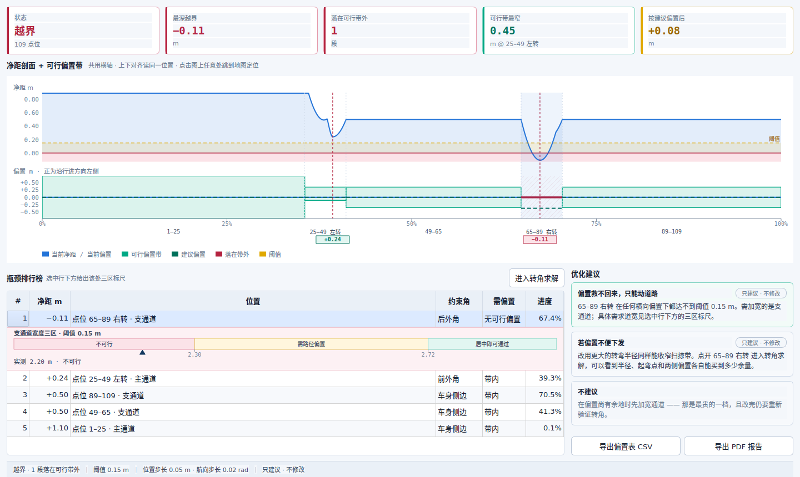
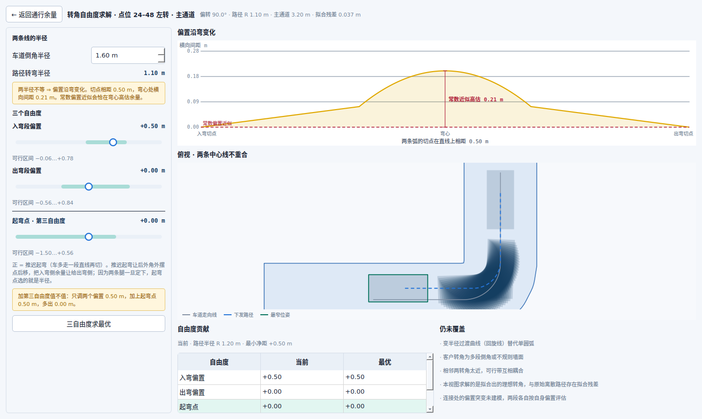
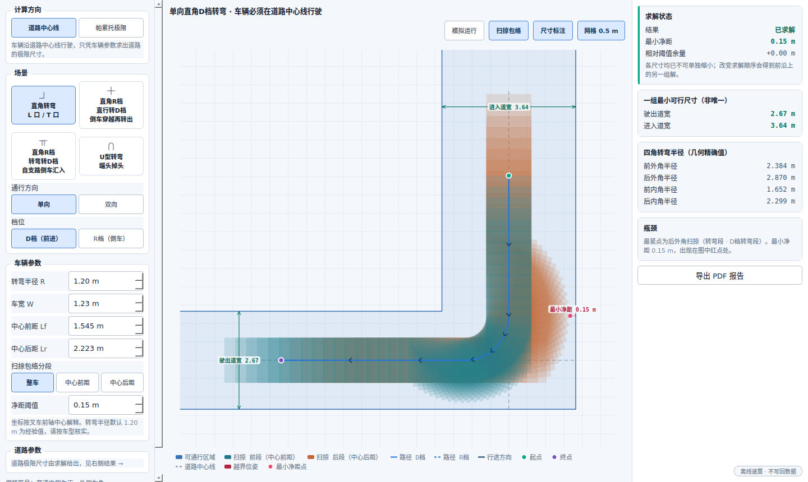
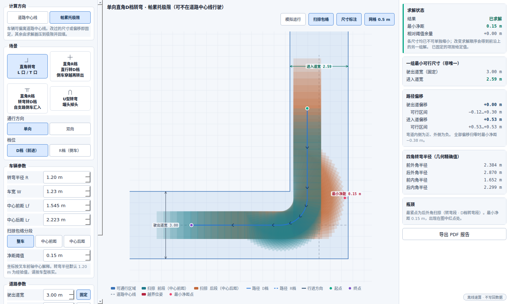

# 用户手册

## 首次运行

1. 启动打包版入口（Windows 为 `RouteAnalysis.exe`，Linux 为 `RouteAnalysis`），或从源码运行 `scripts\run.cmd`（Windows）、`scripts/run.sh`（Linux）。
2. 首次设置至少填写车宽、中心前距、中心后距和新车道默认总宽，均使用米且必须大于 0。
3. 连接页填写完整 API 根地址（例如 `http://host/admin-api`）、租户、用户名和密码。租户默认 `suntae`。
4. 地图方向使用弧度，默认 0。0 表示原始正 X/东显示为屏幕向右。
5. 按需添加 VIN 覆盖尺寸；同一 VIN 只能出现一次。
6. 高级分析可配置位置步长、yaw 步长、净距阈值、自动车道最大拟合偏差（默认 `0.05 m`）、默认弯道模式和日志级别；上次用的两点连接方式也会记住。

密码会明文写入本机 `data/config.json`，请只在受信任账号下使用。

## 查询与进入路径

1. 左侧留空订单 ID 后点击“查询”列出全部订单；填写数字 ID 后精确查询。
2. 使用“上一页/下一页”进行服务端分页。
3. 双击一行或选中后按 Enter，依次进入任务、命令。
4. 进入命令后同时查询并显示下发路径和实际路径；面包屑显示当前订单、任务和命令。
5. 使用“← 返回”回到上一层。
6. 返回任务或订单列表后，画布继续保留最近打开的命令路径；修改车道或点击“立即重新分析”仍会针对该画布路径计算，直到打开另一条命令路径或切换后端/租户。

实际路径固定取后端 `/actualPath`，不会误用速度曲线接口。

## 检查命令点位和原始 JSON

1. 进入命令后，左侧命令表下方出现点位详情；拖动分隔条可调整命令表、点位表和 JSON 区域的高度。
2. “下发点位”和“实际点位”分别列出后端 `positionList` 的全部原始项，默认打开下发点位。表格列为序号、X、Y、Yaw（rad）和 Gear；序号从 1 开始，可在底部输入序号直接跳转。
3. “命令 JSON”显示当前下发或实际来源的完整业务命令对象；选择表格行后自动切到“点位 JSON”，显示该点位的全部原始字段。两个文本区只读，可选择和复制，不截断内容。
4. 选择点位后，画布高亮对应前轴中心点和车辆框；点位在视口外时自动居中但保持当前缩放。缺少 yaw 时只高亮中心点，缺少有效 X/Y 时仍可查看 JSON，但不会在地图定位。
5. 直接点击当前标签对应路径的中心线样本，会反向选择左侧点位行。中心线上的圆点就是可点击的样本位置，每个有坐标的样本都有一个圆点，一个不少；圆点在拥挤处自动变小但不会消失，放大后重新展开。多个样本重合时，在同一位置连续点击可按路径顺序循环选择。
6. 下发和实际标签分别记住最后选择。即使普通中心线或车辆图层关闭，当前点位高亮仍保留；切换命令后旧选择清除。
7. 两类路径分别加载。一侧失败时另一侧仍可查看；失败标签显示原因和“重试”按钮。命令没有实际轨迹时显示“无实际路径数据”。

## 查看路径和车辆

- 蓝色代表下发路径，橙色代表实际执行路径。
- “中心线/车辆/越界”可按路径分别开关。中心线同时画出折线和每个位姿点的圆点；空心圆点表示该点缺少 yaw，不参与转弯和越界分析。密集路径缩小时圆点会缩到很小，要逐点分辨须放大；无有效 X/Y 的点位没有坐标，画布上没有对应圆点，只能在点位表格的数据异常标记中识别。非当前点位标签对应路径的圆点更小更淡，表示它不参与点击命中。
- 车道锚点压在路径点上时（自动生成车道常见），按下不拖动直接松开即可选中该路径点。
- “车辆”一列是四态：**整车 / 仅前段 / 仅后段 / 关**，下发和实际各自独立。仅前段只画前轴中心点到车头那一段，仅后段只画到车尾那一段，分界就在前轴中心点上 —— 想看清某一端到底探出多远时特别有用。这纯粹是显示，越界和净距永远按整车算。
- “仅下发”“仅实际”“全部”可快速隔离。
- 鼠标滚轮缩放，拖动空白区域平移；“适应内容”将远离原点的路径和车道带回视野。网格和轴保持 X/Y 等比例，状态栏显示鼠标所在的原始坐标。
- 每个带 yaw 的原始点绘制车辆矩形；空 yaw 点只显示空心中心标记。
- 在设置中改变地图方向只旋转显示，不改后端路径和已存车道坐标。

## 绘制和编辑车道

1. 进入具有 mapId 的命令后，点击“绘制新车道”。
2. 首次点击前，绿色候选锚点随鼠标移动；开启路径吸附时，候选点会吸附到当前可见路径点。
3. 第一次单击固定起点后，绿色虚线中心线和半透明车道总宽区域实时跟随鼠标；再次单击固定当前锚点，随后继续逐点绘制。鼠标移出画布时只隐藏动态末段，已固定草稿继续显示。
4. 绘制时可在“总宽”输入框实时调整预览宽度；新车道初始值取设置中的默认总宽，连接样式默认为尖角。
5. `Backspace` 撤销最后一个固定锚点；重复点击同一吸附位置不会新增零长度段。至少固定两个不同锚点后，点击“完成车道”、按 `Enter` 或双击可完成，`Esc` 取消整条草稿。
6. 完成只把新车道固化到当前编辑文档，并作为一次撤销操作；仍需点击“保存”才写入本地配置。
7. 在车道列表勾选/取消决定它是否进入可通行区域并集。列表项可重命名。
8. 属性区可修改：
   - 车道名称、真实中心线总长、总宽、启用状态；
   - 开放或闭合环；开放车道为平头；
   - 默认尖角或圆角；
   - 单锚点连接覆盖（继承、尖角、圆角）；
   - 锚点原始 X/Y；
   - 每段直线、真实圆弧或三次贝塞尔；贝塞尔可编辑两个控制点，自动生成的相切圆弧可编辑半径并显示最大允许值。
9. 中心线总长是每段真实长度之和：直线使用欧氏距离，圆弧使用解析弧长，贝塞尔使用高精度数值弧长；闭合车道包含闭合段。修改总长会围绕完整中心线包围盒中心等比缩放锚点、贝塞尔控制点和圆弧圆心，不改变车道总宽。
10. 画布上可直接拖动圆形锚点和黄色贝塞尔控制点；拖动车道中心线或半透明填充会平移整条车道。重叠时手柄优先、已选车道优先，否则选择最上层车道；禁用车道仍可编辑，只是不参与可通行区域并集。
11. 开启吸附时，锚点、控制点及整车道拖动的抓取点接近当前可见路径点会吸附到该点。拖动空白区域仍用于平移画布。
12. Ctrl+Z/Ctrl+Y 或“撤销/重做”可回退添加、删除、整车道平移、长度、宽度、线型和连接设置；一次连续拖动只占一个撤销步骤。

## 在两个点位之间生成车道

1. 先在左侧点位面板选好要用哪条路径（下发或实际）—— 选点只在当前那条路径上生效。
2. 点击“按路径生成”，按钮变成“结束选点”，画布进入选点模式。
3. 在路径上点第一个点位，从弹出的候选列表里确认；再点第二个点位确认。序号与左侧点位表一致，从 1 开始。两个点位必须是不同样本，且都要有 yaw —— 没有 yaw 就算不出车体范围，会拒绝。顺序点反了没关系，系统按序号排。
4. 两点选齐后弹出生成窗口：
   - **连接方式**：沿原路径保留两点之间的实际形状（包括中间的转弯）；直线连接忽略中间形状，此时弯道模式、最大拟合偏差和闭合车道会置灰，因为它们对一条直线没有作用。
   - **车道总宽**默认取全局“新车道默认总宽”。填得比车宽还窄时窗口会提示“两端车体会露出车道”，但不拦你。
   - **弯道模式**（仅沿原路径）：尖角保留真实转角；真实圆弧拟合与两侧直线相切的圆弧，拟合不了会计数并回退尖角；分段三次贝塞尔用切向连续的多段曲线。
5. **车道两端会自动延伸**，各自伸到那个点位车体探出的最远处 —— 窗口里的“两端延伸 X / Y m”就是这两个量。所以生成的车道在长度方向上一定盖得住两端的车。走向线方向和车头朝向一致时，这两个数就是中心前距和中心后距；倒车段或直线连接两个朝向不同的位姿时会自动按车体四角算，仍然盖得住。
6. 画布以半透明区域预览。取消不修改布局；“新增车道”只追加一条普通本地车道，整次确认只占一个撤销步骤。
7. 确认或取消后**仍停在选点模式**，可以接着生成下一条。点“结束选点”或按 `Esc` 退出。

> 想给整条路径生成车道，选首尾两个样本、连接方式用“沿原路径”即可。

## 保存、导入与导出

- 编辑后标题出现 `*`。点击“保存”或 Ctrl+S 写入当前服务器/mapId 文件。
- 每次覆盖保存前，上一版保存为同目录 `.json.bak`。
- 切换 mapId、修改服务器或退出时，未保存内容会提示保存、放弃或取消。
- “导出”写出带 schema、serverId、mapId、单位和全部车道的 JSON。
- “导入替换”先验证和预览数量；服务器/mapId 不同会警告。确认后备份当前文件并整体替换，绝不合并。

## 理解分析结果

- 绿色：所有有效车辆样本在车道并集内，最小净距不低于警告阈值。
- 黄色：仍在并集内，但最小净距低于阈值；接触边界（净距 0）也是黄色。
- 红色：至少一个车辆样本有部分越出车道并集。
- 不可分析：没有启用车道、路径为空或没有任何带 yaw 的有效姿态。

两类路径分别显示最小净距及位置、首次越界位置、越界样本数、有效样本数、缺 yaw 情况，以及当前位置/yaw 采样步长。

默认位置步长 0.05 m、yaw 步长 0.02 rad、净距阈值 0.15 m。步长越小分析越精细但越慢；这是离散扫掠近似，不是解析连续碰撞证明。

## 查看整弯转弯半径

- 下发和实际路径分别计算，直接使用后端 `(x, y, yaw)`，不从车道中心线反推。
- 累计绝对 yaw 变化严格大于 `0.75π rad` 的测量标为掉头。
- 系统不会自动找弯道，也不会建议端点：每条测量都由你自己选两个样本。
- 点击“计算转弯半径”后，先在路径上选择入弯样本，再选择序号更大的出弯样本。同坐标存在多个样本时弹窗列出索引、坐标和 yaw。完成一组后模式保持开启，可继续选择；按 Esc 或再次点击按钮结束。
- 每次在路径上点击都会弹出候选列表：离你点击位置最近的那个样本加粗，外加它前后各两个样本，以及这一击命中的其他重合样本。每项显示序号、坐标和 yaw，序号与左侧点位表格一致。从列表里选一项才算定下端点；关掉列表则什么都不改。路径首尾附近邻居不够就少列几项，不会往另一侧补。
- 画布上只把已定下的端点标成红圈并写出序号，候选中的其他样本保持普通路径点外观。
- 选完入弯点后它的红圈保留；选完出弯点后两个端点同时标红，直到你开始选下一条测量或退出选点模式才清除。
- 每条测量用两个端点位置及其间连续展开的累计 yaw 求一个整弯等效旋转中心，并显示五个固定值：前轴中心、前外角、后外角、前内角、后内角转弯半径。这里没有距离窗口，也不生成局部最小值、中位数或最大值统计。
- “车体左侧/右侧”由整弯等效旋转中心相对入弯车辆航向决定，与车辆前进或倒车无关。缺 yaw、零 yaw 变化或无法得到有限圆心的端点对会明确拒绝。
- 测量按创建顺序平铺显示，可直接重命名或删除；名称在同一路径内唯一，删除后默认编号不回收、不重排。
- 测量保存在 `data/turn-radius-measurements.json`，按后端、租户、订单、任务、命令和路径类型隔离。任一有序 `(x, y, yaw)` 路径点变化都会使对应旧测量失效。早期版本自动计算出的测量在读取时被丢弃。
- 车辆尺寸变化会按原端点刷新四角半径，前轴中心半径不变。结果区注明使用全局尺寸还是 VIN 专属尺寸。
- “显示转弯半径定位图层”默认关闭。选择测量会自动开启并高亮入弯到出弯路径，显示两端车辆矩形、等效旋转中心、五条半径线、五条完整圆弧轨迹和数值标签；前轴中心使用独立颜色。

## 查看通行余量

画布区上方有“地图”“通行余量”“场景速算”三个标签页。切到“通行余量”即对当前命令的**下发路径**求解，一屏回答“哪里最险、能不能靠偏置救、怎么改”。求解只在这一页可见时进行，所以在“地图”页编辑车道不会因为它变卡；改完车道切回来会自动重算。

一页从上到下有四块：

1. **概要指标**：状态、最深越界、落在可行带外的段数、可行带最窄的段、按建议偏置后的最小净距。
2. **主图**：上栏是沿路径的净距剖面，下栏是逐段的可行偏置带，两栏共用同一条横轴。竖虚线把最紧的两处瓶颈从上栏连到下栏，方便对齐着读。偏置的正方向是**沿行进方向的左侧**。
3. **瓶颈排行榜**：按最小净距升序，每段一行；标题栏右侧的“进入转角求解”按钮是进入 3b 的入口，列出约束部位、回到可行带所需的最小偏置和路径进度。约束部位写“后外角”而不是“车身侧边”时，说明卡住的是倒车侧的外摆，不是车宽 —— 这种情况加宽通道的收益远小于调整偏置或半径。
4. **优化建议**：三张卡，首选、次选和不建议。

常用操作：

- **选中一行** —— 在地图中定位到该处，但**不切页**（状态栏会提示已定位到哪个点位）。行点击的产出是它下方展开的标尺，切走就看不到了。
- **点击主图任意处** —— 切到“地图”页并定位到对应位姿。这是唯一会切页的手势。
- **选中一行还会** —— 在该行下方展开这处的三区标尺：不可行 / 需路径偏置 / 居中即可通过，并用三角指针标出该段车道的实测宽度。分界点是真算出来的，不是查表，所以第一次展开需要一两秒。
- **选中转弯行后点“进入转角求解”** —— 进入 3b 详情页。按钮在瓶颈排行榜标题栏右侧，选中直行段时是灰的。双击已选中的转弯行是同样的效果。

### 转角求解

左栏是输入，右栏是结果。

- **两条线的半径**：车道倒角半径读自该转角所在车道的圆弧段；车道在这里是尖角时输入框留空，可以手填一个打算采用的值 —— 填的值只用于这次求解，**不会写回车道**。
- **三个自由度**：入弯段偏置、出弯段偏置、起弯点。滑条上的绿色区段是仍能达到阈值的可行区间。拖动即时重算。
- **起弯点**是第三个自由度，正值表示推迟起弯。两侧偏置一旦定下，圆弧半径就由起弯点决定 —— 推迟起弯会收紧半径，提前起弯会放大半径。半径放大时扫掠带反而变窄，这是最容易被反过来算错的一点。
- **偏置沿弯变化**曲线只在两条线半径不等时出现：横向间距沿弯是零到峰值再回零的拱形，用一个常数偏置去近似，会恰好在最危险的弯心处高估余量。
- **俯视图**把车道走向线和下发路径分开画，两条线不重合正是这一页存在的理由。
- 右下角的**仍未覆盖**列出这套求解没有处理的情况，包括本视图求解的是拟合出的理想转角、与原始离散路径存在残差。残差值显示在标题栏。

### 导出

- **导出偏置表 CSV** —— 每个区段一行，含可行带、耦合区间和建议偏置，UTF-8 带 BOM，Excel 直接打开。
- **导出 PDF 报告** —— A4 横向，样式与屏幕同源。所见即所得：在主视图导出得到概览与瓶颈榜；在转角求解页导出会多一页该转角。选中行的三区标尺会随瓶颈榜一起进报告。页眉带齐订单、任务、命令、车型尺寸及来源、车道布局、步长和阈值 —— 报告会离开这个工具，没有前提的图比没有图更危险。

> 这批功能**只给建议，不修改下发路径，也不修改车道**。所有建议卡上都有“只建议 · 不修改”标签，没有一键应用。全部结果只存活于当次会话，切换命令或重启后不保留，CSV 和 PDF 是仅有的出口。

## 用场景速算

画布区第三个标签「场景速算」**不连接任何数据源** —— 没有选中命令也能用，不发网络请求，不写 `data/`。结果不落盘，切走或重启就没了。

1. 左栏自上而下选：**计算方向**（道路中心线 / 帕累托极限）、**场景**（直角转弯 / 直角 R 档直行转 D 档 / 直角 R 档转弯转 D 档 / U 型转弯）、**通行方向**、**档位**。后两个复合场景的档位固定 R 档转 D 档，控件置灰。
2. **车辆参数**默认取设置里的车型与净距阈值，页内改动只留在内存，不写回配置。转弯半径不进配置，默认 1.20 m，是经验值，请按车型核实。
3. **道路中心线**：车辆全部横向偏移为零，只凭车辆参数反求道路尺寸。左栏道路参数只列给定项（U 型的隔墙宽，后缀「（给定）」），其余尺寸由求解器给出并写在结果卡里。结果卡写着「一组最小可行尺寸（非唯一）」—— 这是帕累托前沿上的一个点，每一项在其余项取当前值时都已不能再单独缩小，但换一组尺寸组合同样成立。
4. **帕累托极限**：车辆可偏离道路中心线。左栏列出该场景全部道路尺寸和全部腿的路径偏移（U 型含起弯点），默认值就是求解器算出的极限尺寸与最优偏移。**改过哪一项，哪一项就固定**：行右侧的「固定」开关自动勾上，求解器不再动它，其余尺寸压到极限、其余偏移重新优化，结果回填到输入框；取消勾选即交回求解器。双向布局里被两条镜像机动共用的腿（T 口支路、十字倒车道、借支路的支路、三巷的中巷）偏移恒为 0，那一行置灰、不可固定。没固定任何横向偏移时，每一项尺寸都不会比道路中心线更大；固定了偏移则可能更大，那是你固定的位置要求的，不是求解器算错。
5. **校核一条给定的路**就是把帕累托极限下的全部尺寸都固定：没有可求的了，结果卡改为通过 / 临界 / 越界，判定规则与地图页的越界分析同源，同时给最小净距、相对阈值余量、瓶颈和各腿的可行偏移区间。偏移可以填超出可行区间的值，结果直接报越界，不拦截。切换场景、通行方向、档位或计算方向会释放全部固定；改车辆参数不会。

### 看懂俯视图

- **扫掠包络分段**在左栏车辆参数里，紧接中心前距与中心后距之下 —— 它切的就是这两项。分界落在前轴中心点上，选「中心前距」画出的正是前轴中心到车头那一段。两段各有固定颜色，对应关系写在图例里。**这只影响绘制，净距判定和求解结果永远按整车算。**
- 路径上的箭头是**行进方向**，不是车头朝向 —— 倒车段两者相反。实线为 D 档段，虚线为 R 档段。
- 起点、终点只画圆点、不写字，免得标注盖住圆点本身。哪个点是哪个看图例：起点绿、终点紫、最小净距点红，三种颜色互不重复。
- 点「模拟运行」，车体包络自起点沿路径跑到终点，约 3.4 秒；双向布局两条机动同时跑。跑完停在终点，中途再点或改任何输入就中止。**它只重放已经算好的位姿，不重新求解、不改任何尺寸。**
- 「扫掠包络 / 尺寸标注 / 网格」三个开关只重绘，不触发重算。

### 各场景的机动

- **直角转弯**：自支路（进入道）起步，直线 → 与两腿相切的四分之一弧 → 沿主路（驶出道）驶离。双向为 T 口，两条镜像机动都**自共用的支路起步、各自驶出到主路两侧** —— 反过来跑会在共用支路里迎头相对。
- **直角 R 档直行转 D 档**：R 档沿倒车道直行穿过转出道并继续下探，再换 D 档转出。双向为十字。
- **直角 R 档转弯转 D 档**：车辆起步时整个停在支路较深处、车头朝支路深处，R 档先沿支路倒车直行一段，再一段四分之一弧倒转到主路一侧，车头摆正后换 D 档沿主路开走（支路内的直行段不影响任何结果，只为把起点画得离支路口远一些）。**支路不设尽头**（车只是停在其中，再深也不构成约束），因此不求支路深度；改为给出**出弯主路深度** —— 倒车摆出占用的那一段主路，自支路开口的外侧壁量起。它由扫掠结果量得而非求解得出，所以结果卡里不加粗。
- **U 型转弯**：上行直线 → 半圆 → 下行直线。双向为三巷两墙，两条机动都**自中巷起步、各自驶入一条外巷**；中巷被两条机动共用，横向偏移固定为零。

> 双向指同一辆车向两个相反方向各做一次机动，取两者中最不利的，**不是两辆车会车**，也不建模错车间距。档位在这里是纯几何量，唯一含义是前后悬相对行进方向对调，不含任何动力学。

要把当前变体带走，点右栏底部的「**导出 PDF 报告**」：一页 A4 横向，俯视图沿用当前图层开关，右栏结果卡原样进页，页眉带齐车辆参数、转弯半径、阈值和全部固定项 —— 收报告的人不需要打开工具就能知道这些数字在什么前提下成立。CSV 不提供。

## 本地日志

- 源码运行写入仓库同级 `log/`；打包运行写入入口可执行文件同级 `log/`。当前文件为 `route-analysis.log`。
- 默认 INFO；在高级设置改为 DEBUG/INFO/WARNING/ERROR 后立即生效并保存。
- 日志在本地日期变化或当前文件达到 20 MiB 时轮转，保留最近 30 个历史文件。日志暂不可写时状态栏持续显示“日志不可用”，后续事件会自动重试。
- INFO 记录生命周期、加载/保存/分析摘要和耗时。DEBUG 按已确认决策原样记录密码、令牌、Authorization/tenant 请求头、完整配置、请求参数、响应正文、路径坐标和导入文件正文，不脱敏、不加密。
- “帮助”菜单可打开日志目录或当前日志；应用不提供上传、发送或清空日志功能。

## 文件位置

源码启动：`route-analysis/data/` 和 `route-analysis/log/`。
打包启动：入口可执行文件（Windows 为 `RouteAnalysis.exe`，Linux 为 `RouteAnalysis`）同级的 `data/` 和 `log/`。

车道文件按服务器和 mapId 隔离，因此不同后端或地图不会自动共用布局。

## 常见问题

- “连接配置无效”：API 根地址必须包含 `http://` 或 `https://`，不能包含账号密码或查询参数。
- “登录失败”：核对租户名、用户名和密码；本工具不处理验证码。
- 实际路径为空：确认命令已有实际执行心跳、VIN 正确且账号具有查询权限。
- 点位行显示 `⚠`：该原始点位存在无效字段；悬停查看原因，点位 JSON 仍保留后端原值。
- 大量灰色中心点：后端路径缺少 yaw；工具按约定不从 `roadYaw` 或相邻点推断。
- 无法选择转弯端点：确认当前路径可见、样本有 yaw；端点须在同一条路径上按先后顺序选取。
- 整弯半径无法计算：检查所选区间是否缺 yaw、累计 yaw 是否为零、端点坐标是否相同，以及端点是否能形成有限等效旋转中心。
- 圆弧生成回退尖角：来源弯道采样不足、并非稳定圆弧或与相邻直线不近似相切；可改用尖角/贝塞尔或提高合理范围内的最大偏差。
- 状态栏显示“日志不可用”：检查同级 `log/` 路径是否可创建或写入；应用会在后续日志事件自动重试。
- 车道像被旋转：检查地图方向弧度。修改方向不会损坏存储坐标。
